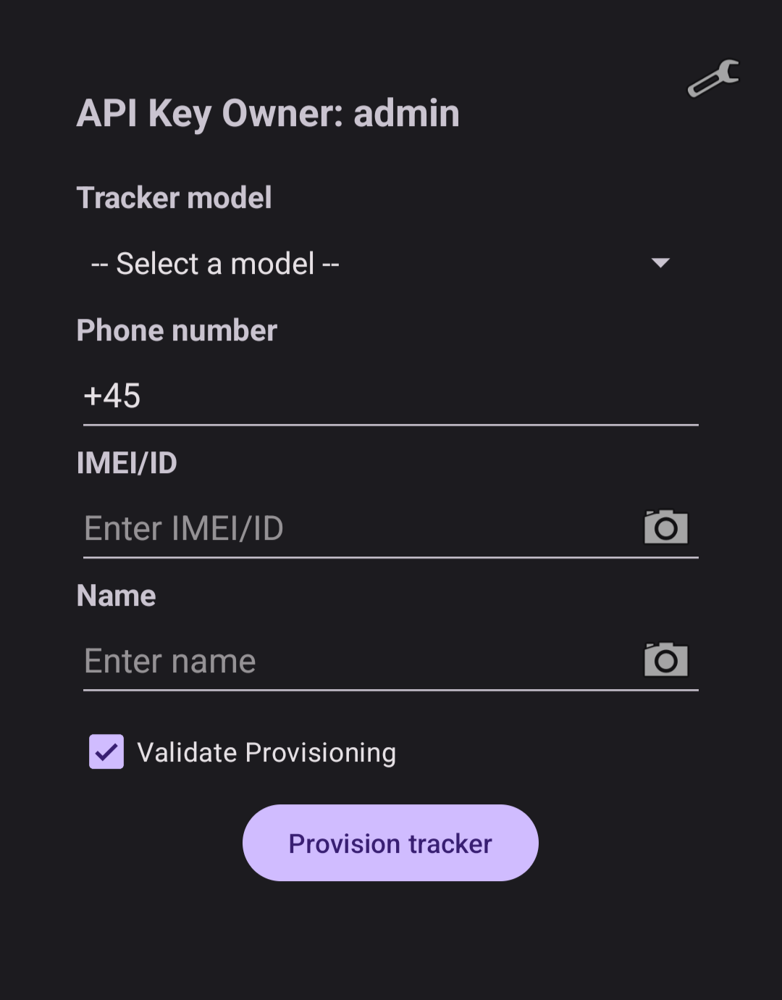

# Bachelor Thesis
This repository contains the source files used in my bachelor thesis titled, "Unlocking the Potential of Cheap GPS Trackers" at Technical University of Denmark.
In the thesis a software solution is developed. Its purpose is to provide a lightweight, service allowing companies to easily integrate low-cost GPS trackers into existing solutions. 

## Preview
<p align="center">
  
  
</p>


## Project architecture
The project consists of 3 main components:
### [Backend](backend)
The backend consists of tracker communication, a sqlite3 database and a REST API.
### [Website](website)
The website uses the REST API, to fetch the location of all Tracker associated with the provided API-KEY. Then it will show real-time location data of the trackers on a [Leaflet](https://github.com/Leaflet/Leaflet) map
### [Android Provisioning App](provisioner)
The provisioning app allows the user to easily register new trackers by leveraging the REST API and the built in camera for Barcode recognition.

## Quick Start
### Backend
1. Clone the repository
```
git clone https://github.com/i74578/Trackerr
cd Trackerr
```
2. Set enviromental variables for backend
```
nano backend/.env
```
3. Build and run the backend
```
cd backend && make && make run
```
### Website
4. Before using the website, the baseurl variable must be set to the API server used.
```
nano nano js/script.js
```
5. Launch website
#### Option A: open directly
Open the website/index.html file and append "?api-key=AAAAAA" to the URL
#### Option B:
```
cd website && npx http-server
```
#### Option C(Recommended):
Install and configure a nginx web server with SSL certificates. Then move the files inside website/ into the nginx server root(/var/www/...) directory

6. Before compiling the app, the baseurl variable must be set to the API server used.
```
cd ../provisioner
nano +23 ./app/src/main/java/com/trackerr/provisioner/apiClient.java
```

7. Compile the Android app
```
./gradlew assembleDebug 
```
8. Transfer APK file located at **./app/build/outputs/apk/debug/app-debug.apk** to your android device and install it

**See each component's README for a more details and options**

# License
The code contained in repository is available under the [MIT license](LICENSE)
