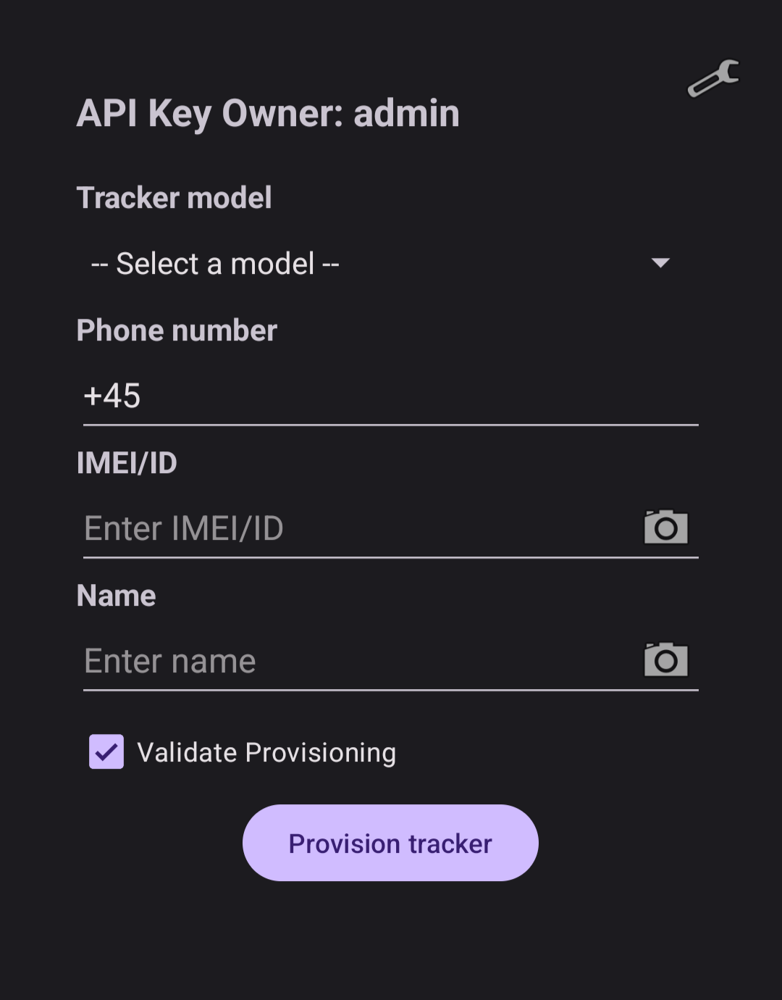

# Android Provisioning App
This directory contains the code for the Android Provisioning App.
The purpose of the app is to simplify and speed up the provisioning process.

## Preview
<p align="center">
  
</p>

## Prerequisites
- Android Studio
- Device with Android 15.0+ (Vanilla Ice Cream)

## Installation
Clone the repository
```
git clone https://github.com/i74578/Trackerr
cd Trackerr/provisioner
```

## Configuration
Before compiling the app, the baseurl variable must be set to the API server used.
```
nano +23 ./app/src/main/java/com/trackerr/provisioner/apiClient.java
```

## Compile to APK
### Option A: CLI
1. Compile the app
```
./gradlew assembleDebug 
```
2. Connect device using USB. Then install the app using:
```
adb install -r app/build/outputs/apk/debug/app-debug.apk
```
3. Launch the Provisioner app from the device
### Option B: Android Studio
1. Launch Android studio and open the provisioner project directory.
2. Let Gradle sync and download dependencies
3. Click Build -> Make Project
4. Connect device using USB
5. Click the Run button to install and run the app

# Usage
After launching the app for the first time, the user must enter a API key to use the app. This API key must exist in the users table in the backend database. The used API key can be changed at any time in the app, by clicking on the gear icon in the top right. 
To register a tracker 
- Select the tracker model in the tracker model section. The model name is generally placed on the same label as the IMEI of the tracker
- Type in the phone number of the SIM card located in the tracker
- Click on the camera icon on the right of the IMEI textfield, and scan the IMEI label on the tracker. If it fails to scan the barcode, then manually typing in the IMEI is required.
- For the Name it also possible to either scan a name barcode or typing it in manually
- Leave "Validate Provisioning" checked, to wait until the tracker is successfully connected to the backend, to make sure the provisioning worked as expected. When bulk of trackers are to be registered, it is generally best to leave it unchecked, to speed up the provisioning process, and then later verify that all trackers have successfully connected to the backend using the /api/v1/trackers api endpoint.
